**서재앱 03 기능과흐름**

이 문서가 답하는 질문: 사용자가 무엇을 할 수 있고, 그게 어떤 순서로 일어나나
현재 기준 문서. 결정이 바뀌면 이 자리에서 고친다. 바뀐 이력은 `서재앱_00_허브.md` 결정 로그에 남긴다.
버전 구분(MVP / 다음 / 그다음 / 후보)은 이 문서에만 적는다. 다른 문서는 여기를 가리킨다.
규칙과 사서의 판단은 02, 화면은 04, 뒤에서 도는 방식은 05.
말의 주체: "나"는 서재앱 사용자(다혜), "사서"는 앱 안의 LLM.
용어: "들어오는 글"은 칸마다 이 칸에 들어오는 것과 다른 칸으로 가는 것을 적은 기준이다. 화면에는 "이 칸에 들어오는 글"로 보인다. 도서관 용어로는 범위주기 (02 1절).

---

**1. 버전을 나누는 기준**

- MVP: 01 4-3의 차이 하나를 증명하는 데 필요한 것. "북마크하면 알아서 꽂히고, 내가 고칠수록 분류 기준이 글로 쌓이며, 그 변화를 검증하고 되돌릴 수 있는 서재"
- 신호를 남기는 기능은 앞으로, 책이 쌓여야 의미가 생기는 기능은 뒤로 (나중에 개선 루프를 돌리려면 처음부터 기록이 있어야 함)
- 다음 버전의 순서: 1) 수서 → 2) 하이라이트·메모와 읽기 도구 → 3) 나머지. MVP에서 쌓인 들어오는 글이 수서의 기준이 되고, 읽을 게 들어온 뒤에 하이라이트·메모가 더 쓸모 있어서다
- 범위를 잠근 뒤 바꾸는 규칙: 새 아이디어는 목록에 적어두고 다음 버전 후보로 둔다. MVP에 넣으려면 대신 뺄 것을 하나 정한다

---

**2. 기능 목록**

**2-1. MVP**

| 묶음 | 기능 |
|---|---|
| 담기 | 북마크 생성 감지, 담지 않는 사이트 목록 확인(기본값 + 내가 추가), 북마크하는 순간 탭 본문 떠두기(확장 안에만) + 서버 수집 → 비교해서 나은 쪽 저장, 로그인해야 보이는 페이지는 페이지 위 알림으로 물어봄(담기 / 이 사이트는 앞으로 담기 / 이번엔 빼기 / 이 사이트는 앞으로 빼기, 대답 전까지 서버로 보내지 않음), 잘렸을 수 있으면 "일부만 담겼을 수 있어요" 표시와 다시 담기, 다시 담기(확장이 원문을 새 탭으로 열어 다시 뜸), 담기 대기열, 수집 실패 시 재시도, 메타데이터 추출(제목·저자·날짜·출처·분량), 캡처 날짜 기록, 논문 DOI·arXiv ID(버전 포함) 저장, 담지 않는 사이트를 북마크하면 페이지 위 알림으로 "서재에 넣지 않았어요" |
| 북마크 연결 | 설치 시 기존 북마크 목록 보관(메타만, 수집 없음), 설치 이후 새 북마크 자동 담기, 자동 담기 폴더 지정(기본은 모든 새 북마크), 폴더를 골라 가져오기(합쳐서 200개까지), 사이트별 미리보기와 체크 해제, 가져오기 전 링크 생존 확인, 장서 점검(크롬을 켤 때·다시 로그인할 때·다시 설치했을 때 놓친 북마크 찾기), 죽은 링크 목록, 북마크 삭제 시 보존 서고로, 같은 주소 재북마크 시 병합, "서재" 북마크 폴더 자동 추가 옵션(기본 꺼둠, 서재가 만든 북마크는 담기 감지에서 제외), 죽은 링크 목록 편집(제목·링크만 서재에 남기기 / 목록에서 치우기) |
| 꽂기 | 시작할 때 넓은 칸 3~5개(들어오는 글 초안 포함), 주제 분류 3회, 신간 띠지, 임시서가, 참조 카드, 칸별 들어오는 글 |
| 정답지 | 사서가 칸마다 고르게 20권을 뽑아 확인 카드로 올림, 나는 "여기 맞아요 / 옮기기"로 채점, 며칠 두면 사서 판단대로 |
| 배우기 | 책 옮기기, 같은 방향 이동 3번이면 규칙 질문(정답지 확정 후), 들어오는 글 수정안, 영향 미리보기, 정답지 회귀 확인, 승인·되돌리기(배너와 버전 목록), 이번 책들만(자리 고정 + 재질문 금지), 새 칸 만들기 |
| 고치기 | 임시서가에서 직접 꽂기, 칸 만들기·이름 바꾸기·나누기·합치기·삭제(책 보낼 곳 묻기), 들어오는 글 직접 편집, 고친 직후 사서 질문(이번만 / 앞으로도 / 직접 관리), 손글씨 이름표 전환, 보존 서고로 내리기·올리기, 원문 비우기(보존 서고에서만, 떠둔 본문·이미지·요약·검색 색인을 지우고 제목·링크·기록은 남김, 백업은 30일 뒤 사라짐), 칸 고르기(초록 카드·뷰어 더보기·사서 보고·정답지 카드에서 칸 이름을 눌러 옮기기, 목록에 임시서가와 + 새 칸), 칸 순서 바꾸기(새 탭에서 칸을 끌어서) |
| 새 탭 | 책장(단순한 도형과 글자), 사서(정지 그림 + 말풍선), 사서 자리(질문·확인·보고가 모임, 질문은 하루 2개), 검색 입구, 새로 꽂힌 칸 빛·책 반짝임, 기다리는 동안 사서의 말(실제 단계와 맞는 말) + 진행률, 가져오는 동안 책이 하나씩 꽂히는 모습 |
| 책장 | 2단 구조(책장 → 칸), 책 표시(색·두께·빛바램·띠지·반투명), 담은 순서 배열, 정렬 바꾸기, 유형 필터, 칸 이름표(인쇄/손글씨), 안 읽은 책 모아보기, 이동 흔적(일주일) |
| 읽기 | 초록 카드(논문은 원문 초록 + 한 줄 요지, 기사는 3줄 요약), 요약 생성·저장, 요약 문장에서 원문 위치로 이동, 요약 다시 생성·직접 수정, 읽기 뷰어(저장본), 읽기 모드 토글(텍스트/원문), 원문 열기, 읽던 위치 저장, 읽은 기준(20% 이상 내려가거나 30초 이상)에 띠지 벗기기 |
| 사서 데스크 | S34 한 페이지(사서 메뉴와 설정에서 들어감): 사서 일지(칸 이동 비율, 정답지 유지율과 한 줄 풀이), 칸별 기준이 바뀐 기록, 책마다 "이 책이 걸어온 길"(초록 카드·뷰어의 "사서 기록 보기") |
| 기록 | 신호 로그(분류 결과, 이동, 열람, 카드만 보고 넘김, 요약 수정, 요약 재생성), 프롬프트·들어오는 글 버전 관리, 정책(트리거 수치) 버전 기록 |
| 기본 | 크롬 확장 설치와 새 탭 교체, 수집 범위 안내(모으는 것 / 모으지 않는 것 / 로그인 페이지는 물어보고 담음), 구글 계정 로그인(크롬 로그인 이용, 계정마다 서재 따로), 로그아웃(못 보낸 책이 있으면 보내고 나갈지 고름), 검색(제목·메타데이터·요약 + 본문 전체, 보존 서고 포함), 백업(매일 자동 복사) + 내보내기(zip, 마크다운), 수집 실패 목록, 빈 서재 화면, 설정(읽기 설정, 저장, 수집·담지 않는 사이트 목록, 계정) |

**2-2. 다음 버전 — 1순위: 수서**

| 묶음 | 기능 |
|---|---|
| 수서 | 들어오는 글을 기준으로 외부 자료 검색(arXiv, Semantic Scholar, OpenAlex, 오픈액세스 저널, 리서치 블로그 RSS), 관련성 판정, 새 탭 신착 서가에 하루 몇 권, 이유 한 줄, 담으면 일반 담기 흐름으로. 세부 로직은 MVP가 돌아간 뒤 설계 (01 4-5) |

**2-3. 다음 버전 — 2순위: 하이라이트·메모와 읽기 도구**

| 묶음 | 기능 |
|---|---|
| 메모 | 원문 페이지 위 선택 도구 모음, 읽기 뷰어에서 선택 메뉴, 하이라이트, 메모, 위치 복원(문장 + 앞뒤 30자 + 문단 번호, 저장본 위치도 함께 계산), "위치를 찾지 못했어요" 상태, 메모 종류 구분, 메모 수정·삭제, 책 한 권의 메모 모아보기, 책 전체 메모, 포스트잇 표시 |
| 읽기 도구 | 용어 설명(버튼 하나, 서재 밖 지식 표시), 상호대차(더 찾아보기 → 담기), 그림 설명(눌렀을 때만 생성) |
| 이어 읽기 | 칸 이어 읽기 (메모가 있는 책 3권 이상인 칸에서만) |

**2-4. 다음 버전 — 3순위 (순서 미정)**

| 묶음 | 기능 |
|---|---|
| 담기 | 확장 아이콘 팝업(이 페이지 상태, 담기 버튼) |
| 큐레이션 | 저녁 큐레이션(기준 섞기, 열어본 뒤 이유 공개, 비중 조절), 크롬 알림 권한 요청 |
| 전시 | 전시 서가(사서 자동 + 직접 만들기) |
| 칸 성장 | 칸 분할·병합 제안, 방으로 묶기 제안 |
| 연결 | 본문 임베딩, 관련 책 추천, 용어 설명을 서재 안 근거로 업그레이드 |
| 요약 품질 | 자동 환각 검사(judge가 요약과 원문 대조) |
| 아카이빙 | 원본 링크 상태 점검, "원본은 사라졌고 내 서재에만 남아 있어요" 표시, Wayback 보관 요청 |
| 사서 | 파츠 조합 애니메이션, 시간대·상태 표현 |
| 읽기 | PDF를 우리 뷰어로 열어 하이라이트 |
| 여러 권 | 여러 권 한꺼번에 옮기기 |
| 오프라인 | 인터넷이 끊겼을 때 메모를 확장 저장소에 넣어두고 연결되면 올리기 |
| 폰 | PWA로 읽기·메모(저장본 기준), iOS 단축어 담기 |
| 3D | 3D 서재 ("서재 들어가기") |

**2-5. 그다음 — 개선 루프와 공유**

| 묶음 | 기능 |
|---|---|
| 자기개선 | 실패 사례 모아 원인 진단, 들어오는 글 수정안 자동 생성, 정답지로 회귀 확인, 승인 후 반영·되돌리기 |
| 공유 | 책 한 권 빌려주기(메모 + 링크), 초대한 소수만 보기, 공유용 심플 버전 화면 |
| 보존 | 파일 해시 대조, 3-2-1 백업 자동화 |
| 읽기 | "쉽게 풀어줘", 배경 설명, 자유롭게 묻기 (참고 데스크) |
| 사서 채팅 | 범위를 좁혀 시작: 찾기("평가 칸에서 요약에 대한 글"), 자리 묻기("그 논문 어디 뒀지"), 정리 부탁("이 칸 나눠줘") |
| 북마크 | 북마크 폴더 이동을 칸 이동으로 받기 ("칸도 옮길까요?"), 양방향 연결 |

자기개선 루프가 셋째 단계인 이유: 처음에는 신호를 쌓기만 하고, 수정은 사서 질문으로 사람이 직접 승인한다. 루프를 돌릴 재료가 쌓인 뒤에 자동화하는 순서라 안전하고, 개선 과정도 숫자로 보여줄 수 있다.

사서 채팅이 셋째 단계인 이유: 무슨 말이든 받으면 실패 지점이 늘고, "잘 답했나"를 판정할 기준을 새로 만들어야 하며, 비용이 매번 든다. 지금 만드는 규칙 질문·제안이 이미 사서의 말이라, 채팅이 붙으면 같은 목소리로 이어진다.

**2-6. 후보로만**

- 할 일 트래커: 아이데이션. 왜 새 탭에 두는지 이유를 이야기하면서 붙인다
- 노션 가져오기
- 기존 북마크 폴더 이름을 첫 칸 초안의 참고 자료로 쓰기
- 용도·질문 칸을 전시 서가와 별개로 두기
- 영상 담기 (열린 질문)
- 카드뉴스 이미지 글자 읽기 (그림 설명 경로로 흡수 가능)

---

**3. 흐름**

MVP 흐름의 정본은 9절 흐름도다. 순서와 갈림길은 흐름도에서만 고친다. 이 절에는 흐름도에 담기지 않는 설명과, 아직 흐름도를 그리지 않은 다음 버전 흐름(수서, 메모하기)만 둔다. 문구와 사서 말투는 따로 모은다 (5절).

흐름도에 담기지 않는 설명
- 확장 설치: 혼자 쓸 때는 개발자 모드, 공개 시 웹스토어 (A1)
- 이름을 입력하면 사서가 그 자리에서 한 번 불러준다. 예: "다혜님의 서재를 만들게요" (A1)
- 나이는 쓰임이 없어 받지 않는다. 호칭은 이름으로 받는다 (A1)
- 크롬 알림 권한은 저녁 큐레이션을 붙일 때 함께 요청한다. 시작하자마자 묻지 않는다 (A1)
- 온보딩은 서재에 처음 들어와 사서를 만나는 장면이라 나중에 스토리를 입힐 자리다. 가져오기를 고르면 들어온 책이 곧 첫 칸이 되고, 건너뛰면 관심 주제가 곧 첫 칸이 되어 인사와 기능이 겹친다 (A1)
- 폰 크롬에서 한 북마크는 크롬 동기화로 PC에 내려오고, PC 크롬이 켜질 때 담긴다. 열린 탭이 없어서 서버 경로만 쓴다. 사파리 북마크는 들어오지 않는다 (B1, B3)
- 가져오기 결과 화면이 "사라지지 않는 서재"를 보여주는 자리다. "가져온 북마크 중 몇 %가 이미 사라졌어요" (B2)
- 규칙 질문의 세부 로직(조건, LLM 출력 형식, 코드 확인, 비용)은 02 6절 (C2-1, C2-2)
- 책 삭제는 없다. 보존 서고로 내린다 (C9)

초록 카드 내용 (D1-1)

| 유형 | 카드에 담는 것 | LLM이 하는 일 |
|---|---|---|
| 논문 | 원문 초록 + 한 줄 요지 | 한 줄만 생성 |
| 기사·리포트 | 3줄 요약 | 요약 생성 |

- 추출만으로 채우는 안(논문 초록, 기사 첫 문단)은 논문에만 통해서 기사 카드가 비게 된다. 그래서 요약 생성을 MVP에 넣었다
- 담을 때 한 번 만들어 저장한다 (열 때마다 다시 만들지 않음)
- 요약 문장에서 원문 위치로 이동하면 환각이 바로 드러난다
- 다시 생성, 직접 수정 버튼이 요약 품질의 신호다
- 자동 환각 검사는 다음 버전. 먼저 사람이 고친 기록을 쌓고 그 뒤에 judge 기준을 만든다
- 카드에는 지금 꽂힌 칸 이름이 붙고, 눌러서 바로 옮길 수 있다 (칸 고르기)

다음 버전 흐름 (흐름도는 MVP가 돌아간 뒤에 그린다)

**수서 (다음 버전 1순위)**

1. 사서가 칸별 들어오는 글로 검색 기준을 만든다
2. 공개 출처에서 새 자료를 찾는다
3. 관련성을 판정하고 이유 한 줄을 붙인다
4. 새 탭 신착 서가에 하루 몇 권 올린다
5. 담으면 B1-2의 서버 수집부터 (일반 담기)
6. 담음 / 열어만 봄 / 넘김이 신호로 남는다

세부는 MVP가 돌아간 뒤 설계한다.

**메모하기 (다음 버전 2순위)**

두 경로 모두 같은 기록을 쓴다.

원문 페이지에서
1. 웹을 보다가 문장을 선택
2. 선택 근처에 작은 메뉴: 하이라이트 / 메모 / 용어 설명 / 서재에서 읽기
3. 담기지 않은 페이지면 먼저 담고 하이라이트를 붙인다
4. 이미 서재에 있는 페이지면 기존 하이라이트를 페이지 위에 복원해서 보여준다

읽기 뷰어에서
1. 본문에서 문장을 선택
2. 같은 메뉴
3. 하이라이트 → 포스트잇이 본문 위치에 맞춰 붙는다
4. 메모 → 입력 → 하이라이트에 메모 표시
5. 용어 설명 → 뜻풀이 두세 줄 + "서재 밖 지식" 표시 → 그대로 두기 / 고치기 / 지우기
6. 용어 설명 카드의 "더 찾아보기" → 상호대차
7. 책을 덮은 뒤: 그 책의 메모 모아보기

제약
- PDF는 크롬 기본 뷰어 위에서는 어렵다. 우리 뷰어로 열어야 한다 (3순위)
- 폰(PWA)에서는 저장본에서만 가능

용어 설명 범위
- 버튼 하나로 뜻풀이만. 사서가 자기 지식으로 쓰고 "서재 밖 지식" 표시
- 같은 용어를 다시 선택하면 저장해둔 설명을 먼저 보여준다 (단순 비교, 임베딩 없이)
- 임베딩이 붙으면 내 서재 안에 근거가 있을 때 그 책으로 연결한다. 표시가 사라짐 = "이 주제는 이제 내 서재가 답할 수 있다"
- 화면이 빽빽해지지 않게: 본문에는 밑줄만, 누르면 작은 카드로
- 설명이 쌓이면 "내 용어 사전"이 된다

용어 설명과 상호대차의 구분

| | 용어 설명 | 상호대차 |
|---|---|---|
| 언제 | 읽다가 막혔을 때 | 읽다가 더 알고 싶어졌을 때 |
| 하는 일 | 짧은 뜻풀이를 책 안에 메모로 남김 | 서재 밖에서 찾아와 새 책으로 담음 |
| 끝난 뒤 | 읽던 자리로 돌아감 | 서재에 책이 한 권 늘어남 |
| 도서관으로 치면 | 사전 찾기 | 서가에 없는 자료를 다른 도서관에서 받아오기 |

- "서재 밖 지식"은 기능이 아니라 용어 설명에 붙는 출처 표시다. 표시를 누르면 밖에서 근거를 찾아 출처 2~3개를 보여주고, 출처마다 "이 글 담기" 버튼이 붙는다
- 모든 용어마다 검색을 돌리는 대신 확인하고 싶은 것만 눌러서 돌리므로 비용도 아낀다

수서·상호대차·저녁 큐레이션의 구분

| | 누가 시작 | 어디서 | 무엇을 |
|---|---|---|---|
| 수서 | 사서가 먼저 | 서재 밖 | 내 칸 기준에 맞는 새 자료 |
| 상호대차 | 내가 눌렀을 때 | 서재 밖 | 읽던 용어·주제의 근거 자료 |
| 저녁 큐레이션 | 사서가 먼저 | 서재 안 | 오늘 다시 볼 만한 내 책 |

---

**4. 북마크 연결 규칙**

용어: 크롬 동기화는 크롬이 기기 사이에 북마크를 옮기는 기능이다. 서재앱 기능에는 "동기화"라는 말을 쓰지 않고 자동 담기, 가져오기, 장서 점검으로 부른다. 장서 점검은 도서관에서 서가의 책과 목록을 맞춰보며 빠진 책을 찾는 일에서 온 이름이다.

| 상황 | 처리 | 버전 |
|---|---|---|
| 설치 시점 | 기존 북마크는 담지 않는다. 제목·주소·폴더·추가일만 읽어 목록으로 보관 | MVP |
| 설치 이후 새 북마크 | 자동으로 담긴다 | MVP |
| 자동 담기 범위 | 지정한 폴더만 담도록 설정 가능. 기본은 모든 새 북마크 | MVP |
| 기존 북마크 | 사서가 제안하거나 내가 폴더를 골라 가져온다. 합쳐서 200개까지, 동시에 두세 개씩 천천히 수집 | MVP |
| 가져오기 전 | 주소만으로 살아 있는지 먼저 확인하고, 죽은 링크는 따로 모은다 | MVP |
| 북마크 삭제 | 서재에서는 지우지 않고 보존 서고로 내린다 | MVP |
| 같은 주소 재북마크 | 새 책을 만들지 않고 기존 책에 합친다 | MVP |
| 담지 않는 사이트 | 앱 기본값(메일, 은행·결제, 문서 도구 등) + 내가 설정에서 추가 + 로그인 알림에서 "앞으로 빼기". 걸리는 사이트는 탭 본문을 뜨기 전에 거른다. 서버에 저장해 재설치 시 복원 | MVP |
| 로그인해야 보이는 페이지 | 페이지 위 알림으로 물어봄. "이 사이트는 앞으로 담기"를 누르면 묻지 않고 담는 사이트에, "앞으로 빼기"를 누르면 담지 않는 사이트에 들어감. 놓치면 사서 자리에 남고, 7일 동안 대답이 없으면 탭 본문은 지우고 제목·링크만으로 C등급 | MVP |
| 가져오기 미리보기 | 사이트별로 묶어 보여주고 체크를 풀 수 있음 | MVP |
| 장서 점검 | 크롬을 켤 때·다시 로그인할 때·다시 설치했을 때, 크롬 목록과 "서버가 본 목록"을 비교해 놓친 것만 찾음. 10개 이하면 조용히 담고, 넘으면 물어봄 | MVP |
| 로그인이 풀린 동안 북마크 | 확장 안에만 보관. 다시 로그인한 서재에 담을지 물어봄 | MVP |
| 북마크 제목 변경 | 무시. 서재 제목은 메타데이터 기준 | MVP |
| PC가 두 대 (같은 구글 계정) | 서재는 하나. 두 확장이 같은 북마크를 보내도 같은 주소라 한 권으로 합침. 북마크한 PC에만 탭 본문이 있으므로 탭 본문이 있는 쪽 결과를 우선 (세부는 05) | MVP |
| 서재 → "서재" 북마크 폴더 | 기본 꺼둠. 켜면 서재에 담긴 책을 "서재" 폴더에 북마크로 추가. 서재가 만든 북마크는 담기 감지에서 제외하고, 지워도 무시. "서재" 폴더는 칸 구분 없이 한 폴더에 모으기만 한다. 그래서 칸을 옮기거나 버전을 되돌려도 크롬 북마크는 움직이지 않는다 | MVP |
| 북마크 폴더 이동 | 무시. 나중에 "칸도 옮길까요?"로 묻는다 | 그다음 |

북마크와 서재는 따로 운영되고 한 방향으로 흐른다. 자동 담기·가져오기·장서 점검은 "어떤 책이 들어오나"를, 들어오는 글 버전과 되돌리기는 "들어온 책을 어느 칸에 두나"를 다룬다. 버전과 되돌리기는 크롬 북마크를 건드리지 않고, 되돌리기는 시점 전체를 되감는 백업과도 다르다. 북마크는 주소 한 줄이고, 서재는 원문·요약·메모·분류를 담는다. 크롬 북마크 구조는 사용자의 기존 습관이므로 바꾸지 않는다. 크롬 폴더는 책을 가져오는 단위일 뿐 분류 기준이 아니다 (02 5절).

---

**5. 문구·캐릭터로 따로 모을 것**

- 사서 캐릭터: 집사 고양이. 말투, 호칭, 파츠 조합 (02 7절)
- 화면 문구: 인사, 빈 서재, "담는 중", 정답지 확인 카드, 질문 문구, 가져오기 보고
- 실패 문구: 수집 실패, 원본 사라짐, 일부만 담김, 위치를 찾지 못함
- 사서의 목소리가 질문·보고·큐레이션·전시 제목·수서 이유에 걸쳐 있어 한자리에서 정해야 일관된다

---

**6. 경계 항목 판정**

| 항목 | 결정 | 이유 |
|---|---|---|
| 요약 생성·다시 생성·직접 수정 | MVP | 초록 카드가 비지 않게. 요약 품질의 유일한 신호 |
| 참조 카드 | MVP | 확률적 실패를 처리하는 경로라 MVP 핵심 주장의 일부 |
| 기존 북마크 가져오기 | MVP (합쳐서 200개까지) | 첫날 책장을 채워 정답지를 빨리 만들기 위해 |
| 수동 칸 나누기·합치기 | MVP | 칸이 틀렸을 때 고칠 길이 있어야 함. 사서의 분할 제안은 다음 |
| 검색 (본문 전체 포함) | MVP | 서버 저장이라 처음부터 가능 |
| 백업 (자동 복사 + 내보내기) | MVP | 서버 저장이라 자동 복사가 쉬움 |
| 수집 실패 목록 | MVP | Hermes가 멈춘 원인이 결정론적 실패였고, 이런 실패는 로그를 봐야 잡힘 |
| 사서 데스크 | MVP | 성공 기준(칸 이동 비율, 정답지 유지율)을 내가 볼 수 있어야 하고, "학습 과정이 보인다"를 매일 확인하는 자리 |
| 칸 고르기, 칸 순서 바꾸기 | MVP | 틀린 걸 본 자리에서 바로 고쳐야 학습 신호가 쌓임. 칸 순서는 내 손으로만 바뀜 |
| 탭 본문 떠두기와 로그인 페이지 담기 | MVP (혼자 쓰는 동안) | 잡코리아 JD처럼 로그인해야 보이는 글을 내 사용으로 테스트. "로그인·유료라서 서버가 못 가져온 비율"을 지표로 두고, 공개 전에 약관·법을 다시 판단 |
| 원문 비우기 | MVP | 로그인 페이지를 담는 만큼 마지막 안전장치가 필요. 책 삭제 없음 원칙은 유지 |
| 계정 삭제 | 흐름만 정의 (A4) | 혼자 쓰는 동안은 필요 없고, 친구 공유나 공개 전에 구현 |
| 확장 아이콘 팝업 | 다음 | 북마크로 담기가 되므로 급하지 않음 |
| 하이라이트·메모 | 다음 2순위 | MVP는 분류가 배운다는 증명에 집중 |
| 상호대차 | 다음 2순위 | 용어 설명과 한 몸이라 같이 움직임 |
| 사서 애니메이션 | 다음 | MVP는 정지 그림 + 말풍선 |
| 3D 서재 | 다음 | 새 탭은 가볍게, 그래픽 예산은 사서에 |
| iOS 단축어 | 다음 | 폰 크롬 북마크가 크롬 동기화로 PC에 들어와서 충분 |
| 오프라인 메모 | 다음 | 메모 자체가 다음 버전 |
| 여러 권 한꺼번에 옮기기 | 다음 | 칸 분할 제안이 다음 버전이라 한꺼번에 옮길 일이 적음 |

---

**7. MVP 완료 기준**

1. 북마크하면 원문이 저장되고 칸에 꽂힌다. 담지 않는 사이트 목록의 사이트는 담기지 않고, 로그인해야 보이는 페이지는 물어본 뒤 담긴다
2. 북마크 폴더를 가져오면 사서가 칸마다 고르게 20권을 올리고, 내가 채점해 정답지가 만들어진다
3. 새 탭에서 책장과 사서가 보이고, 안 읽은 책을 초록 카드로 훑고 뷰어로 읽을 수 있다
4. 책을 세 번 옮기면 사서가 규칙을 묻고, 영향 미리보기와 정답지 회귀를 보여주며, 승인하면 들어오는 글이 바뀌고 되돌릴 수 있다
5. 칸마다 들어오는 글을 읽고 고칠 수 있고, 사서 데스크에서 칸 이동 비율·정답지 유지율·기준이 바뀐 기록·책이 걸어온 길을 볼 수 있다

4·5번까지 돌아가면 "학습 과정이 보이고, 검증되고, 되돌릴 수 있는 분류"라는 이야기가 완성된다. 포트폴리오에서 보여줄 그림도 여기서 나온다.

MVP 성공 기준(4~8주 사용 후)은 01 6절.

---

**8. 결정 필요**

- 새 칸이 생기면 정답지를 보강할지 (02 5절)
- 정답지에 든 책을 나중에 옮기면 정답을 바꿀지 (02 5절)
- 할 일 트래커를 둘 이유 (후보)
- 흐름도에서 나온 결정 필요는 9절 각 묶음 끝에 있다

---

**9. 흐름도**

흐름마다 순서도로 그린다. 둥근 상자는 시작, 마름모는 갈림길, 점선은 예외다. 상자 안의 S 번호는 04의 화면 번호다. 보기용 페이지는 아티팩트 "서재앱 흐름도"에 같은 내용이 있다. 원본은 이 문서다.

묶음: A 시작과 계정 / B 담기 / C 정리 / D 읽기 / E 설정 / F 공통 예외. 수서와 메모하기(다음 버전)는 MVP 흐름을 다 그린 뒤에 그린다.

**A. 시작과 계정**

A1. 시작하기 (온보딩) · S01 → S02 / S14

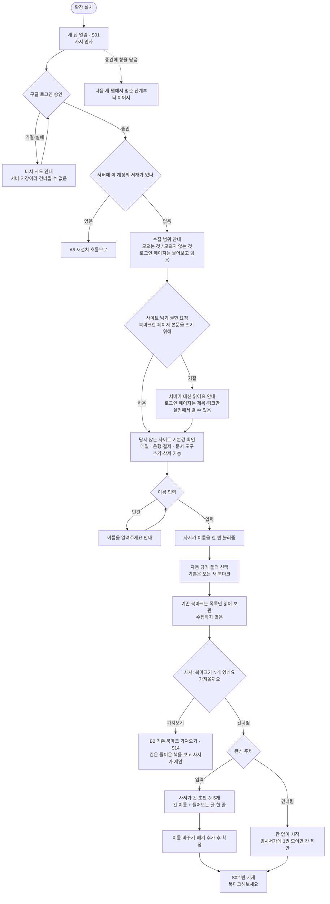

A2. 로그인 만료와 재로그인 · S02 → S31

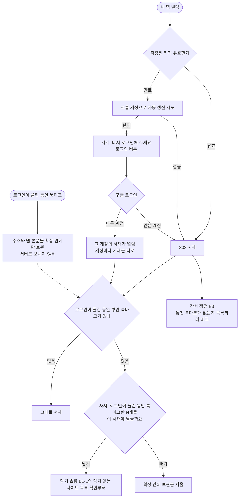

A3. 로그아웃 · S12

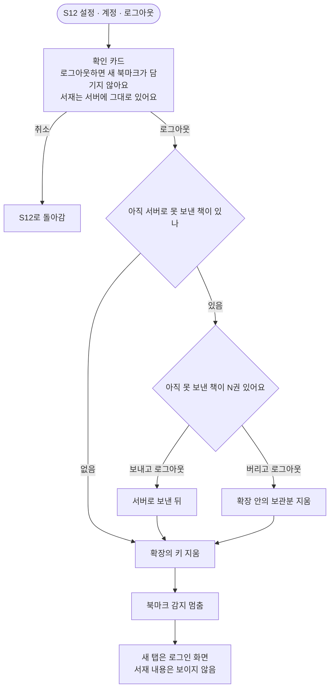

A4. 계정 삭제 (흐름만 정의. 구현 시점은 친구 공유나 공개 전) · S12 → S33 → S01

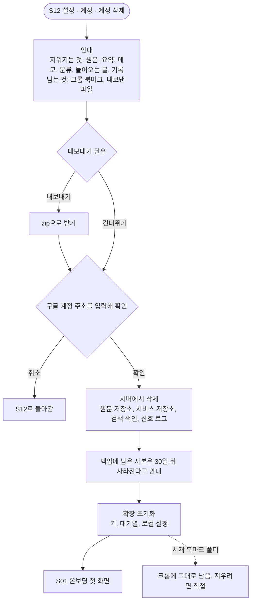

A5. 확장을 지웠다가 다시 설치 · S01 → S31 → S02

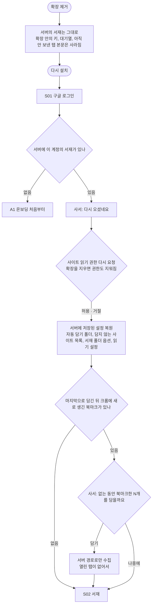

A 묶음에서 새로 정한 것
- 온보딩 순서: 가져오기를 고르면 관심 주제를 묻지 않고, 수집이 끝난 뒤 사서가 들어온 책을 보고 칸 초안을 제안함. 가져오기를 건너뛰면 관심 주제로 칸 초안을 만듦 (A1, B2)
- 계정마다 서재는 따로. 다른 구글 계정으로 로그인하면 그 계정의 서재가 열림 (A2)
- 로그인이 풀린 동안 쌓인 북마크는 다시 로그인한 서재에 담을지 물어봄. 다른 계정으로 로그인해도 같은 질문이라 섞이지 않음 (A2)
- 로그아웃할 때 못 보낸 책이 있으면 "N권이 있어요"를 보여주고 보내고 나갈지, 버리고 나갈지 고르게 함 (A3)
- 다시 로그인하면 전체를 다시 가져오지 않고, 장서 점검으로 북마크 목록끼리 맞춰봐서 놓친 것만 찾음 (B3)
- 수집 범위 안내와 담지 않는 사이트 목록 기본값 확인을 온보딩에 넣음 (로그인 직후)
- 담지 않는 사이트 목록과 설정은 서버에 저장해서 재설치하면 복원
- 로그인이 풀린 동안 북마크한 것은 확장 안에만 두고 서버로 보내지 않음
- 재설치하면 없는 동안의 북마크를 찾아 담을지 물어봄
- 사이트 읽기 권한은 온보딩의 수집 범위 안내 바로 뒤에 이유를 설명하고 따로 요청함. 거절해도 온보딩은 이어지고, 서버가 대신 읽는다는 안내와 설정에서 켤 수 있다는 안내를 함 (A1)
- 확장을 지우면 크롬이 읽기 권한도 지우므로, 재설치 때 "다시 오셨네요" 뒤에 권한을 다시 물음 (A5)

**B. 담기**

B1-1. 담기: 거르기 · 웹페이지

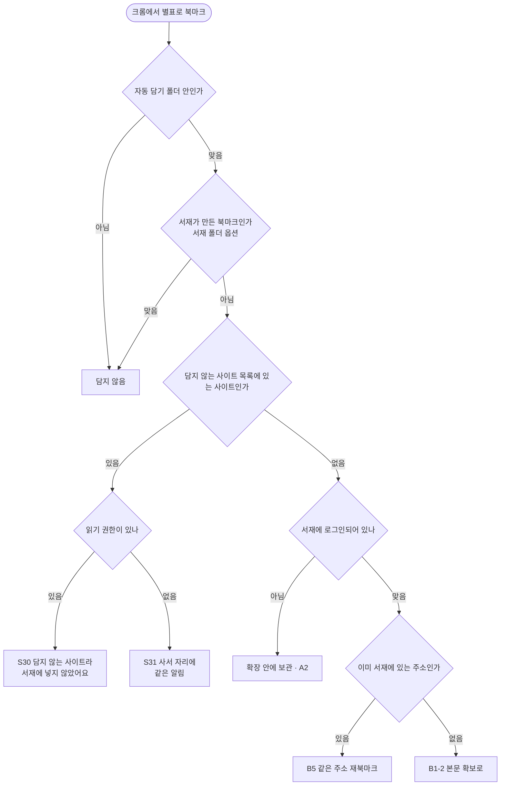

B1-2. 담기: 본문 확보와 로그인 확인 · 웹페이지 → S30 / S31

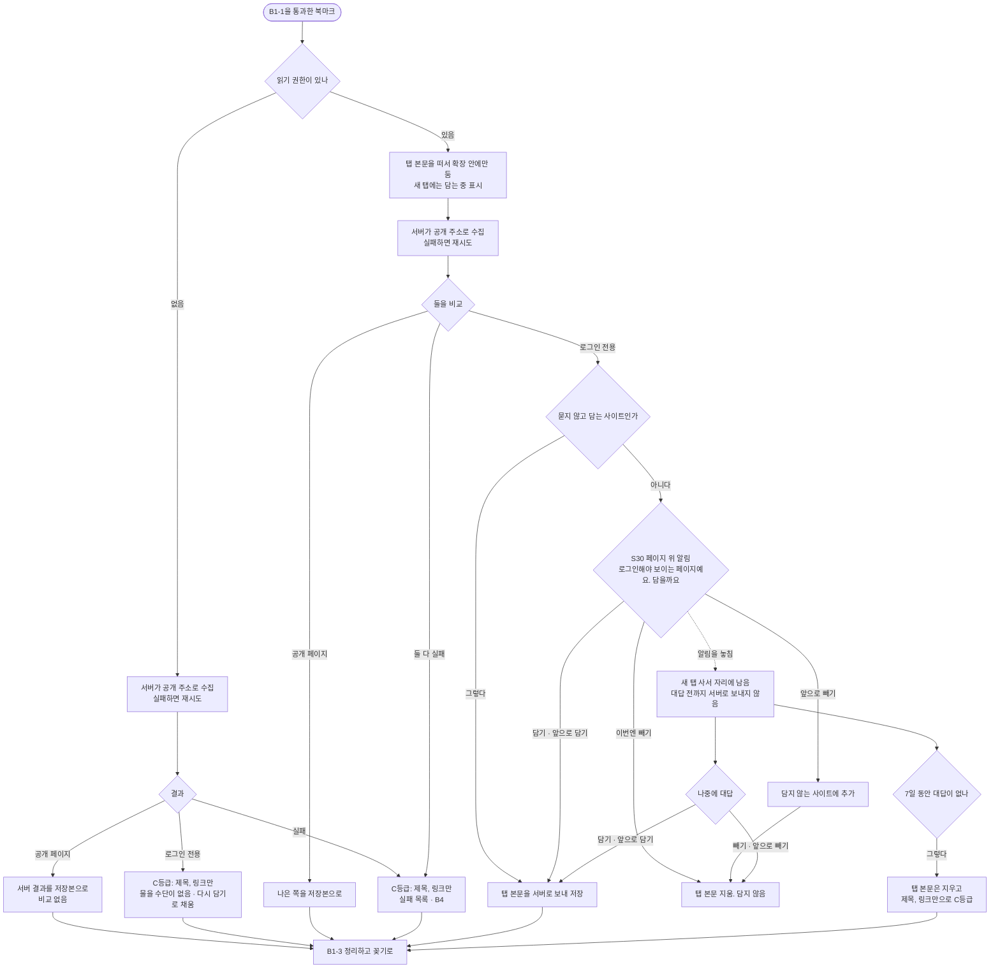

B1-3. 담기: 정리하고 꽂기 · S02 / S03

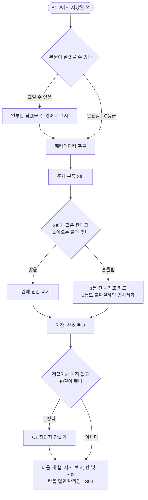

B2. 기존 북마크 가져오기 · S31 또는 S12 → S14 → S15 → S17

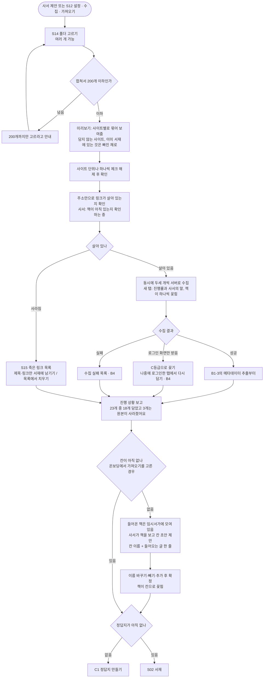

B3. 장서 점검 (놓친 북마크 찾기) · S31

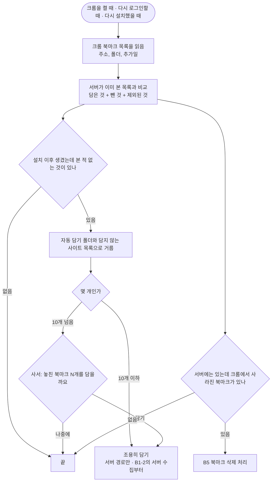

B4. 수집 실패와 다시 담기 · S13 / S07 → 웹페이지 → S30

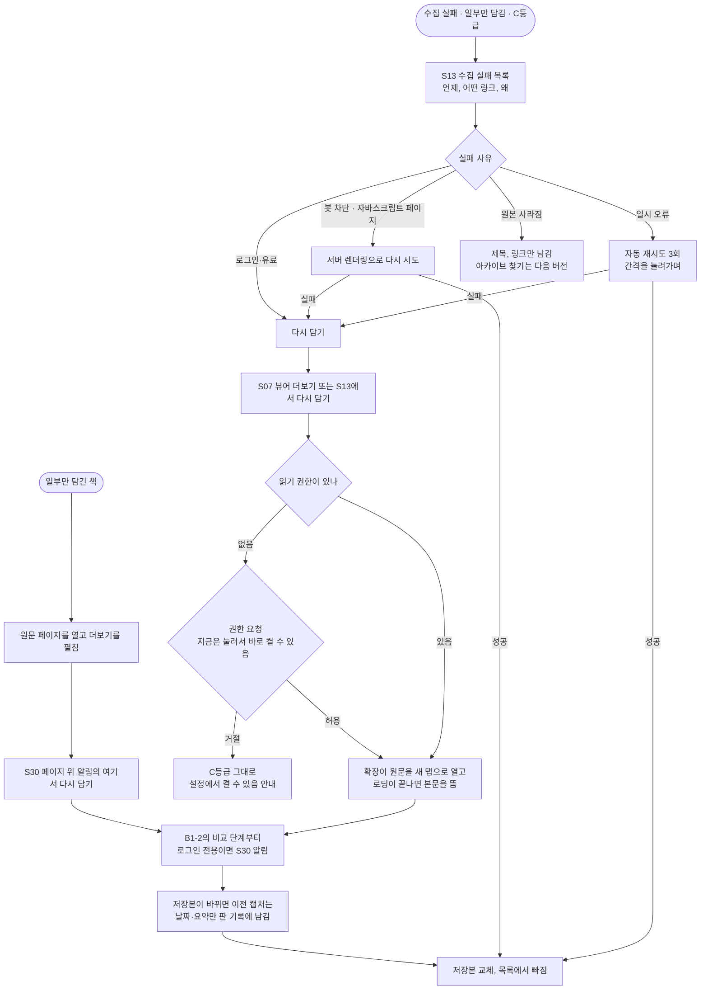

B5. 크롬에서 북마크 삭제, 같은 주소 재북마크 · S31 → S09

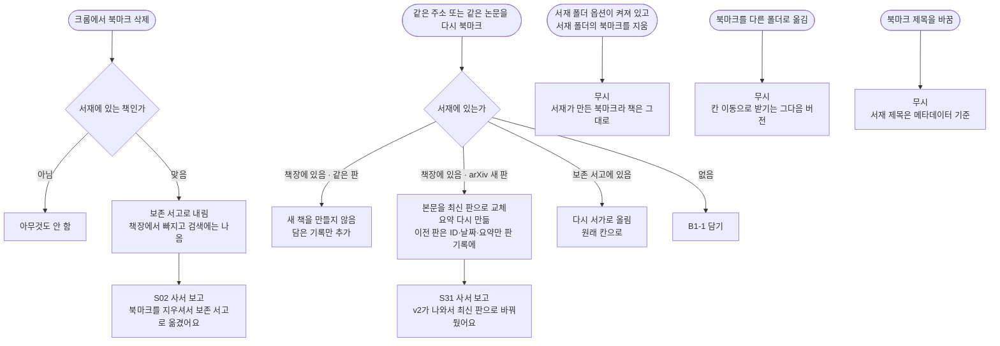

B 묶음에서 새로 정한 것
- 담지 않는 사이트를 북마크하면 S30으로 "담지 않는 사이트라 서재에 넣지 않았어요"를 알림 (B1-1)
- 죽은 링크 목록은 보기와 편집: 제목·링크만 서재에 남기기 / 목록에서 치우기 (B2)
- 가져오는 동안 새 탭에 진행률과 사서의 말을 보여주고, 책이 하나씩 꽂히는 모습이 보임. 사서의 말은 실제 단계와 맞춤 (B2)
- 로그인 전용 페이지 알림을 놓치면 새 탭 사서 자리에 남고, 나중에 대답할 수 있음. 7일 동안 대답이 없으면 탭 본문은 지우고 제목·링크만으로 C등급으로 꽂음. 나중에 다시 담기로 본문을 채울 수 있음 (B1-2)
- 놓친 북마크가 10개 이하면 묻지 않고 조용히 담고, 넘으면 사서가 물어봄 (B3)
- 서재 폴더 옵션을 켠 상태에서 서재 폴더의 북마크를 지우면 무시. 서재가 만든 북마크라 책은 그대로 (B5)
- 담기 순서: 자동 담기 폴더 → 서재가 만든 북마크 제외 → 담지 않는 사이트 목록 → 로그인 상태 → 중복 → 탭 본문(확장 안) → 서버 수집 → 비교 (B1-2)
- 로그인 전용 페이지는 페이지 위 알림(S30)으로 물어봄: 담기 / 이 사이트는 앞으로 담기 / 이번엔 빼기 / 이 사이트는 앞으로 빼기. 대답 전까지 서버로 보내지 않음. 하루 질문 상한 밖 (B1-2)
- 가져오기는 폴더를 고른 뒤 사이트별 미리보기에서 체크를 풀 수 있음 (B2)
- 가져오기에서 로그인 화면만 받은 것은 C등급으로 꽂고, 나중에 로그인한 탭에서 다시 담을 수 있음 (B2, B4)
- 장서 점검은 전체를 다시 가져오는 게 아니라 목록끼리 비교해서 본 적 없는 것만 찾음. "본 목록"에는 뺀 것과 제외된 것도 들어가서 다시 묻지 않음 (B3)
- 다시 담기는 확장이 원문을 새 탭으로 열어 로그인된 상태의 본문을 뜨는 방식 (B4)
- 일부만 담긴 책은 원문에서 더보기를 펼친 뒤 페이지 위 알림의 "여기서 다시 담기"로 교체 (B4)
- 북마크 제목 변경과 폴더 이동은 무시 (B5)
- 읽기 권한이 없으면 탭 본문을 뜨지 못하므로 서버 수집만 하고 비교는 건너뜀. 로그인 전용 페이지는 물을 수단(S30)이 없어 바로 C등급으로 꽂고, 다시 담기로 채울 수 있음. 담지 않는 사이트 알림도 S30 대신 S31 사서 자리로 (B1-1, B1-2)
- 다시 담기를 누른 순간은 권한을 켤 수 있는 자리라, 권한이 없으면 여기서 요청함. 거절하면 C등급 그대로 (B4)
- 같은 논문의 새 판(arXiv v2)을 북마크하면 새 책을 만들지 않고 본문을 최신 판으로 바꾸고 요약을 다시 만듦. 이전 판은 ID·날짜·요약만 판 기록에 남기고, 사서 보고로 한 번 알림. 다시 담기로 저장본이 바뀔 때도 같은 판 기록을 씀. 판 기록의 데이터와 판정은 05 4-4 (B4, B5)

**C. 정리**

C1. 정답지 만들기 · S31 → S17

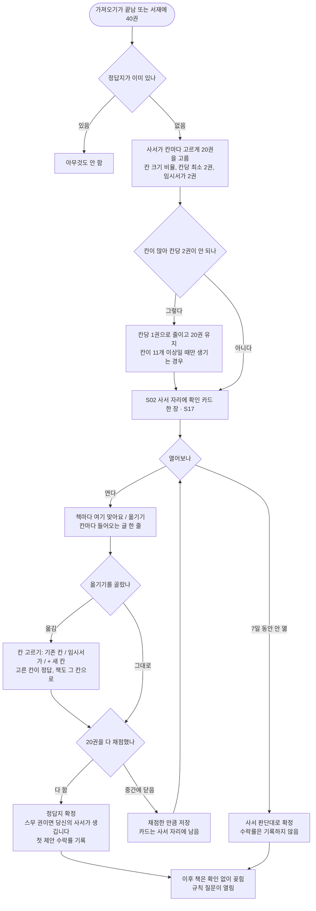

C2-1. 책 옮기기에서 규칙 질문이 생기기까지 · S03 / S07 → S31

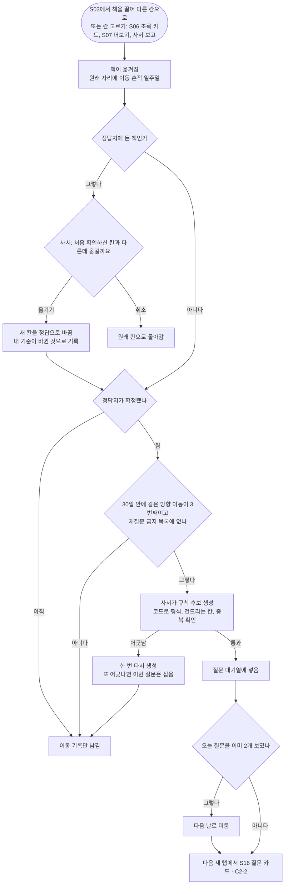

C2-2. 규칙 질문에 답하기 · S16

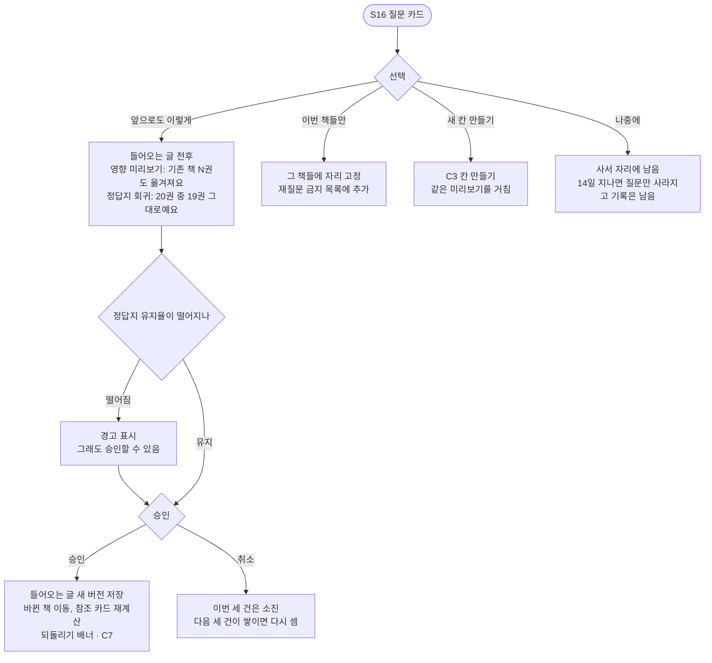

C3. 칸 만들기, 이름 바꾸기 · S02 / S03 → S11

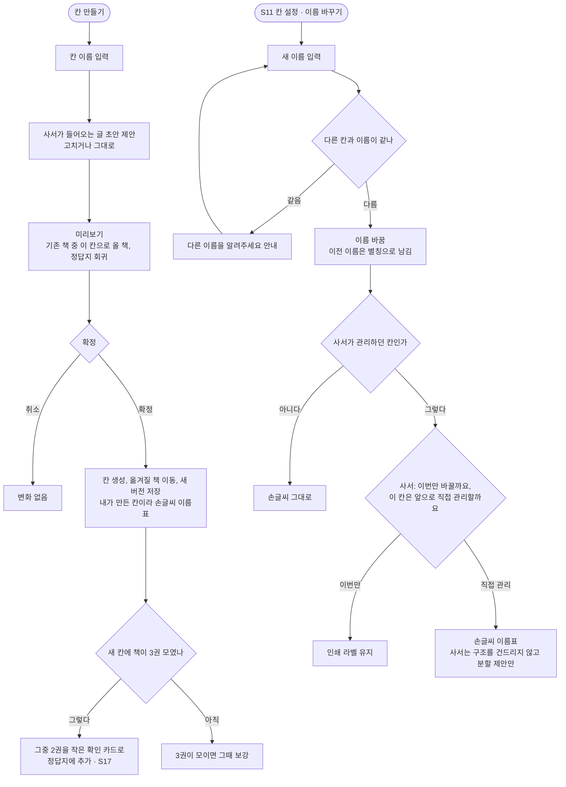

C4. 칸 나누기, 합치기 (수동) · S11

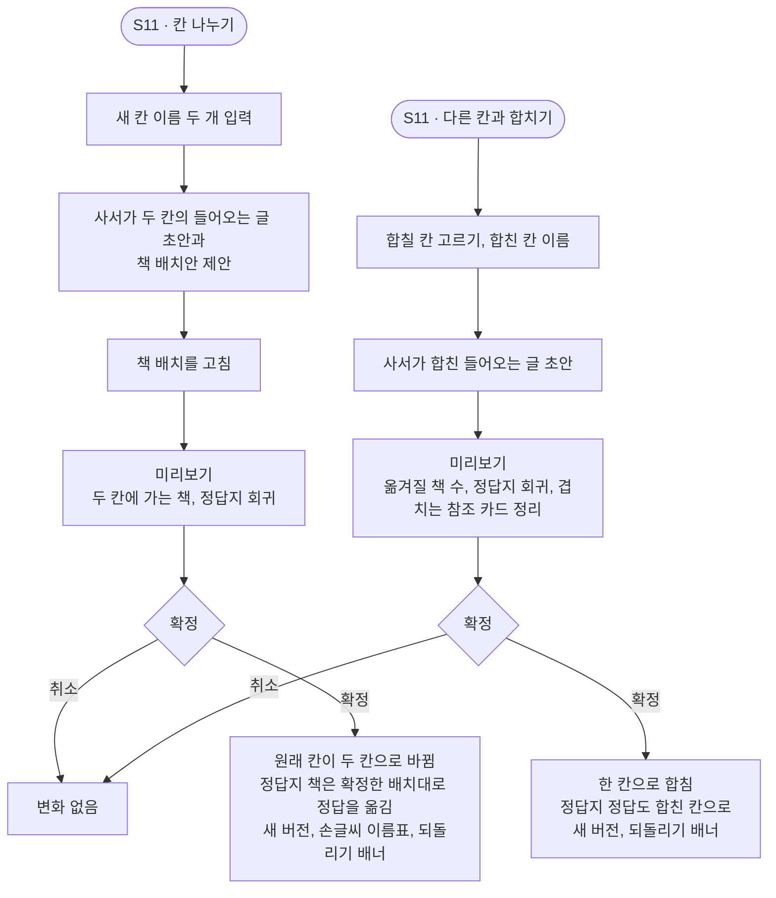

C5. 칸 삭제 · S11

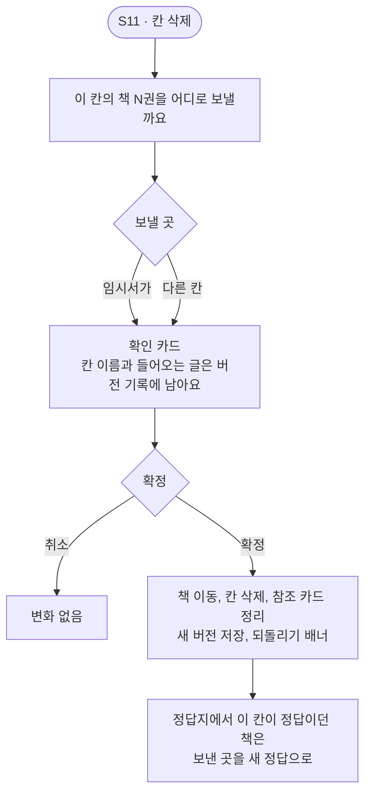

C6. 들어오는 글 직접 편집 · S11

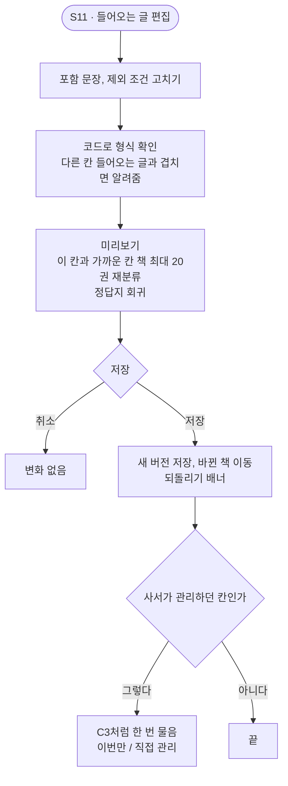

C7. 버전 되돌리기 · S02 배너 / S11

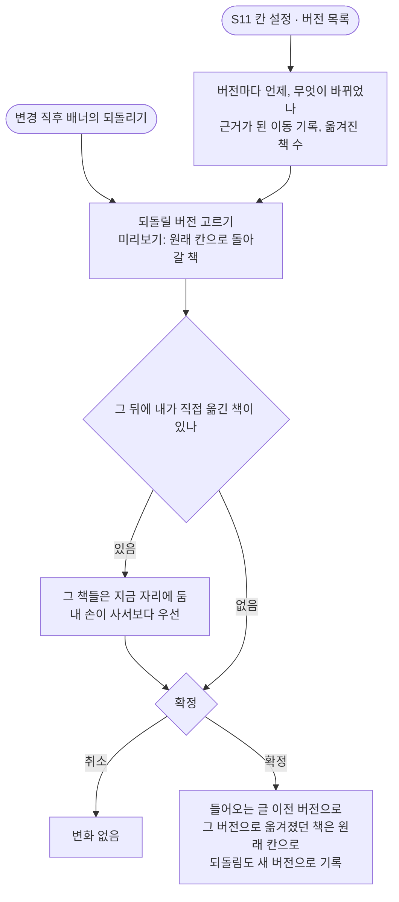

C8. 임시서가에서 꽂기, 새 칸 제안 받기 · S04 / S31 → S17

```mermaid
flowchart TD
  A([임시서가에 책이 들어옴]) --> B{"같은 무리가 3권 모였나"}
  B -- 그렇다 --> C["사서가 새 칸 제안<br/>이름, 들어오는 글, 들어갈 책<br/>하루 질문 상한 안"]
  C --> D{"대답"}
  D -- 만들기 --> E["칸 생성, 인쇄 라벨<br/>사서가 만든 칸"]
  D -- 고쳐서 만들기 --> E2["이름, 들어오는 글 고쳐서 생성<br/>손글씨 이름표"]
  E --> E3["정답지 보강<br/>3권 중 2권을 작은 확인 카드로 · C3"]
  E2 --> E3
  D -- 거절 --> F["같은 제안 2주 보류"]
  D -- 나중에 --> G["사서 자리에 남음<br/>14일 지나면 사라짐"]
  B -- 아니다 --> H{"한 달 넘게 혼자 남았나"}
  H -- 그렇다 --> I{"사서: 가까운 칸으로 옮길까요"}
  I -- 옮기기 --> K["그 칸으로, 이동 기록"]
  I -- 그대로 --> L["같은 제안 2주 보류"]
  H -- 아니다 --> M["기다림"]
  N([S04에서 내가 직접 꽂기]) --> O["칸 고르기, 꽂힘<br/>이동 기록, C2-1의 이동 세기에 들어감"]
```

C9. 보존 서고로 내리기, 다시 올리기, 원문 비우기 · S03 / S07 → S09

```mermaid
flowchart TD
  A(["S07 더보기 또는 S03에서 보존 서고로 내리기"]) --> B["책장과 칸 두께에서 빠짐<br/>검색에는 나옴"]
  A2(["크롬에서 북마크 삭제 · B5"]) --> B
  B --> C["S09 보존 서고"]
  C --> D{"동작"}
  D -- 다시 올리기 --> E{"원래 칸이 아직 있나"}
  E -- 있음 --> E1["원래 칸으로"]
  E -- 없음 --> E2["임시서가로"]
  D -- 원문 비우기 --> F["안내<br/>본문, 이미지, 요약, 검색 색인이 지워져요<br/>제목, 링크, 칸, 내 기록은 남아요<br/>백업에서는 30일 뒤 사라져요"]
  F --> G{"확인"}
  G -- 취소 --> C
  G -- 비우기 --> H["C등급 책으로 남음<br/>다시 담기로 채울 수 있음"]
  D -- 그대로 둠 --> C0["보존 서고에 남음"]
```

C10. 칸 순서 바꾸기 · S02

```mermaid
flowchart TD
  A(["S02에서 칸을 끌어 다른 자리로"]) --> B["칸 순서가 바뀜<br/>내 손으로만 바뀌고 저절로는 바뀌지 않음"]
  B --> C["되돌리기 배너"]
  D(["처음 칸이 생길 때"]) --> E["사서가 순서를 정함<br/>책이 많은 칸부터"]
  E --> F["그 뒤 새 칸은 맨 뒤에 붙음<br/>기존 칸 순서는 그대로"]
```

C 묶음에서 새로 정한 것
- 칸이 11개 이상이라 칸당 2권이 안 되면 칸당 1권으로 줄이고 20권은 유지. 시작은 3~5칸이라 드문 경우 (C1)
- 정답지에 든 책을 옮기면 사서가 "처음 확인하신 칸과 다른데 옮길까요"를 물음. 사용자에게 정답지라는 말은 꺼내지 않음. 옮기면 새 칸이 정답이 되고 내 기준이 바뀐 것으로 기록, 취소하면 원래 칸으로. 편집 중이라 하루 질문 상한 밖 (C2-1)
- 정답지를 만든 뒤 새 칸이 생기면, 그 칸에 책이 3권 모였을 때 2권을 작은 확인 카드로 정답지에 추가 (C3, C8)
- 정답지 확인 카드는 중간에 닫아도 채점한 만큼 저장되고, 7일 동안 열지 않으면 사서 판단대로 확정. 이때 수락률은 기록하지 않음 (C1)
- 규칙 후보가 코드 확인에서 두 번 어긋나면 이번 질문은 접음 (C2-1)
- 규칙 질문에서 승인을 취소하면 이번 세 건은 소진되고, 다음 세 건이 쌓이면 다시 셈 (C2-2)
- "나중에"로 둔 질문과 제안은 14일 지나면 사라지고 기록은 남음 (C2-2, C8)
- 칸 만들기, 나누기, 합치기, 들어오는 글 직접 편집도 규칙 질문과 같은 미리보기와 정답지 회귀를 거침 (C3, C4, C6)
- 칸 이름을 바꾸면 이전 이름은 별칭으로 남음 (C3)
- 칸을 나누거나 합치거나 지우면 정답지의 정답도 확정한 배치대로 따라감 (C4, C5)
- 되돌리기는 그 뒤에 내가 직접 옮긴 책은 건드리지 않음. 되돌림도 새 버전으로 기록 (C7)
- 보존 서고에서 다시 올릴 때 원래 칸이 없으면 임시서가로 (C9)
- 칸 고르기: 초록 카드, 뷰어 더보기, 사서 보고, 정답지 확인 카드에서 칸 이름을 눌러 바로 옮김. 목록에는 기존 칸, 임시서가, + 새 칸이 있음. 틀린 걸 본 자리에서 고쳐야 학습 신호가 쌓임 (C1, C2-1)
- 칸 순서는 새 탭에서 끌어서 바꿈. 처음 순서는 사서가 책이 많은 칸부터 정하고, 새 칸은 맨 뒤에 붙음. 저절로는 바뀌지 않음 (C10)

**D. 읽기**

D1-1. 훑기: 책장에서 초록 카드까지 · S02 → S03 / S04 / S05 → S06

```mermaid
flowchart TD
  A([새 탭 열기 · S02]) --> B["책장과 사서가 보임<br/>띠지, 빛바램, 새로 꽂힌 칸 빛"]
  B --> C{"어디로"}
  C -- 칸 누르기 --> D["S03 칸 화면<br/>정렬 바꾸기, 유형 필터, 좌우로 다른 칸"]
  C -- 안 읽은 책 --> E["S05 띠지 두른 책만"]
  C -- 임시서가 --> F["S04 임시서가"]
  C -- 책장에서 책 누르기 --> G
  D -- 빈 칸 --> D0["아직 책이 없어요<br/>북마크하면 여기로 와요"]
  D --> G["책 누르기"]
  E --> G
  F --> G
  G --> H["S06 초록 카드가 겹쳐 뜸<br/>논문: 원문 초록 + 한 줄 요지<br/>기사: 3줄 요약"]
  H -. 요약이 아직 없음 .-> H0["요약 만드는 중 표시<br/>제목과 출처만"]
  H --> I{"다음 행동"}
  H0 --> I
  I -- 넘기기 --> J["다음 카드<br/>카드만 보고 넘긴 기록"] --> H
  J -. 마지막 카드 .-> O
  I -- 읽기 --> K{"본문 등급"}
  K -- A · 일부만 담김 --> L["D1-2 뷰어로"]
  K -- B · C --> M["S08 원문 보기<br/>다시 담기 안내 · B4"]
  I -- 원문 열기 --> N["원문 페이지를 새 탭으로<br/>원문 이탈 기록"]
  I -- 칸 이름 누르기 --> Q["칸 고르기로 옮기기 · C2-1<br/>옮겼어요 · 되돌리기"] --> I
  I -- 사서 기록 보기 --> R["이 책이 걸어온 길 · S34"]
  I -- 닫기 --> O["이전 화면<br/>그 책이 꽂힌 자리가 보이는 상태"]
```

D1-2. 뷰어에서 읽기 · S07

```mermaid
flowchart TD
  A(["S06 카드의 읽기 · S10 검색 결과"]) --> B{"전에 읽던 책인가"}
  B -- 그렇다 --> B1{"이어서 읽기 / 처음부터"}
  B1 --> C
  B -- 처음 --> C["S07 뷰어<br/>요약 블록, 본문, 진행 막대<br/>읽는 중에는 사서가 말을 걸지 않음"]
  C --> D{"동작"}
  D -- 읽기 모드 토글 --> E["원문 모드와 텍스트 모드 전환<br/>원문 모드로 넘어간 횟수 기록"] --> C
  D -- 요약 다시 생성·수정 · 요약 문장 --> G["D3 요약"]
  D -- 더보기 --> H{"고르기"}
  H -- 다시 담기 --> H1["B4"]
  H -- 칸 옮기기 --> H2["C2-1"]
  H -- 보존 서고로 --> H3["C9"]
  D -- 원문 열기 --> I["원문 페이지를 새 탭으로"]
  D -- 닫기 --> J{"20% 넘게 내려갔거나<br/>30초 넘게 머물렀나"}
  J -- 그렇다 --> K["띠지 벗겨짐, 열람 기록<br/>읽던 위치 저장"]
  J -- 아니다 --> L["띠지 그대로<br/>읽던 위치만 저장"]
  K --> M["들어온 화면으로<br/>그 책이 꽂힌 자리가 보이는 상태"]
  L --> M
  C -. 인터넷 끊김 .-> O["이미 열어둔 화면은 그대로 읽힘<br/>다시 생성, 다시 담기는 잠김<br/>새로 여는 것은 F1 안내"]
```

D2. 검색 · S02 → S10 → S07 / S03

```mermaid
flowchart TD
  A([S02 검색 입구]) --> B["검색어 입력<br/>필터: 칸, 유형, 보존 서고 포함"]
  B --> C["제목, 메타데이터, 요약, 본문 전체에서 찾음<br/>보존 서고 책도 포함"]
  C --> D{"결과가 있나"}
  D -- 없음 --> E["찾는 책이 없어요<br/>검색어를 바꾸거나 칸에서 찾아보세요<br/>못 찾은 검색어는 기록"]
  D -- 있음 --> F["S10 결과 목록<br/>어디서 찾았는지: 제목, 요약, 본문 문장<br/>칸 이름, 보존 서고 표시"]
  F --> G{"누르기"}
  G -- 책 --> H["S07 뷰어로 바로<br/>본문에서 찾았으면 그 문장 위치로"]
  G -- 칸 이름 --> I["S03 그 칸<br/>그 책이 반짝임"]
  G -- 보존 서고 책 --> J["S07 뷰어<br/>다시 올리기 안내 · C9"]
  G -- 닫기 --> K["S02로"]
```

D3. 요약 다시 생성, 직접 수정, 근거 확인 · S06 / S07

```mermaid
flowchart TD
  A(["S07 요약 블록 또는 S06 카드"]) --> B{"동작"}
  A -. 원문이 없는 책 C등급 .-> Z0["요약 대신 제목, 링크, 내 메모만<br/>다시 생성 버튼 없음"]
  B -- 다시 생성 --> C["새 요약 생성<br/>이전 버전 보관"]
  C --> C1{"새 요약이 마음에 드나"}
  C1 -- 그대로 --> D["새 요약 사용<br/>재생성 기록"]
  C1 -- 이전으로 --> E["이전 버전으로 돌림"]
  B -- 직접 수정 --> F["편집 후 저장<br/>내가 고친 요약 표시<br/>고치기 전후를 기록"]
  F --> F1["나중에 다시 생성해도<br/>내가 고친 요약은 버전으로 남음"]
  B -- 요약 문장 누르기 --> H{"원문에서 근거 위치를 찾았나"}
  H -- 찾음 --> I["그 위치로 이동, 강조<br/>근거 확인 기록"]
  H -- 못 찾음 --> J["원문에서 근거를 찾지 못했어요 표시<br/>환각 의심으로 기록"]
  J --> K{"다시 생성할까요"}
  K -- 다시 생성 --> C
  K -- 그대로 --> L["표시를 남긴 채 둠"]
```

D4. 사서 데스크 보기 · S02 / S12 / S06 / S07 → S34

```mermaid
flowchart TD
  A1(["사서를 눌러 메뉴의 사서 데스크"]) --> B
  A2(["S12 설정의 사서 데스크"]) --> B
  B["S34 사서 데스크"] --> C{"보기"}
  C -- 사서 일지 --> D["칸 이동 비율, 정답지 유지율<br/>숫자 옆 한 줄: 지난달보다 칸 이동이 줄었어요"]
  C -- 칸별 기준 기록 --> E["칸마다 들어오는 글이 언제, 왜 바뀌었는지<br/>누르면 S11 버전 목록"]
  C -- 책 찾기 --> F["책을 골라 이 책이 걸어온 길"]
  A3(["S06 초록 카드 또는 S07 더보기의<br/>사서 기록 보기"]) --> F
  F --> G["담긴 경로, 분류 3회 결과, 맞은 들어오는 글 문장<br/>내가 옮긴 기록, 근거가 된 규칙 버전<br/>사실은 로그에서 그대로 가져옴"]
```

D 묶음에서 새로 정한 것
- 초록 카드를 열었는데 요약이 아직 없으면 "요약 만드는 중"과 제목·출처만 보여줌 (D1-1)
- 빈 칸을 열면 "아직 책이 없어요, 북마크하면 여기로 와요" (D1-1)
- B·C등급 책은 카드의 "읽기"가 원문 보기와 다시 담기 안내로 감 (D1-1)
- 띠지는 뷰어를 닫을 때 읽은 기준(20% 또는 30초)을 넘었으면 벗겨지고, 넘지 않았으면 그대로. 읽던 위치는 둘 다 저장 (D1-2)
- 인터넷이 끊기면 이미 열어둔 뷰어 화면은 읽히고, 다시 생성·다시 담기는 잠김. 새로 여는 것은 F1 안내 (D1-2)
- 검색 결과에서 책을 누르면 초록 카드를 거치지 않고 뷰어로, 본문에서 찾았으면 그 문장 위치로 (D2)
- 검색했는데 못 찾은 검색어는 기록해 둠. 수서를 설계할 때 "내 서재에 없는 관심사"의 재료가 됨 (D2). 검색 품질(한국어, 부분 일치, 결과 순서)과 못 찾은 검색어의 쓰임은 직접 쓰면서 고도화한다
- 요약 다시 생성은 이전 버전을 보관하고 되돌릴 수 있음. 내가 고친 요약은 다시 생성해도 버전으로 남음 (D3)
- 요약 문장의 근거 위치를 원문에서 찾지 못하면 "근거를 찾지 못했어요" 표시와 함께 환각 의심으로 기록하고, 다시 생성할지 물음. 근거 확인은 코드로 함 (D3)
- 원문이 없는 C등급 책은 요약을 만들지 않음 (D3)
- 초록 카드에서 칸 이름을 눌러 바로 옮길 수 있고, "사서 기록 보기"로 이 책이 걸어온 길을 볼 수 있음 (D1-1)
- 사서 데스크(S34)는 사서 메뉴와 설정 두 곳에서 들어감. 사서 일지, 칸별 기준 기록, 책이 걸어온 길을 한곳에 모음. 기록의 사실(날짜, 경로, 분류 결과, 버전)은 로그에서 코드로 가져오고, LLM은 문장 다듬기만 함 (D4)

**E. 설정**

E1. 읽기 설정, 이름 바꾸기, 앱 정보 · S12

```mermaid
flowchart TD
  A([S12 설정]) --> B{"묶음"}
  B -- 읽기 --> C["글자 크기, 줄 간격, 다크 모드"]
  C --> C1["바로 적용, 서버에 저장<br/>다시 설치해도 복원"]
  B -- 계정 · 이름 --> D["새 이름 입력"]
  D --> D1{"빈칸인가"}
  D1 -- 빈칸 --> D2["이름을 알려주세요 안내"] --> D
  D1 -- 입력 --> D3["저장. 사서가 새 이름으로 한 번 불러줌"]
  B -- 앱 정보 --> G["버전, 수집 범위 안내 다시 보기, 개인정보 안내<br/>원래 새 탭으로 돌아가려면 크롬 확장 관리에서 끄기 안내"]
```

E2. 자동 담기 폴더 바꾸기 · S12 → S14

```mermaid
flowchart TD
  A([S12 설정 · 수집 · 자동 담기 폴더]) --> B["폴더 고르기<br/>모든 새 북마크 / 고른 폴더만"]
  B --> C["저장. 이 순간부터 새 북마크에 적용"]
  C --> D{"새로 넣은 폴더에 이미 북마크가 있나"}
  D -- 없음 --> Z["끝"]
  D -- 있음 --> E{"사서: 이 폴더에 이미 있는 북마크 N개도 가져올까요"}
  E -- 가져오기 --> F["B2 미리보기부터"]
  E -- 괜찮아요 --> Z
  C -. 뺀 폴더 .-> G["이미 담긴 책은 서재에 그대로<br/>앞으로 그 폴더의 새 북마크만 안 담김"]
```

E3. 담지 않는 사이트, 묻지 않고 담는 사이트 관리 · S12 → S32

두 목록 모두 사용자만 정한다. 사서가 알아서 사이트를 넣거나 빼지 않는다.

```mermaid
flowchart TD
  A([S12 설정 · 수집]) --> B{"동작"}
  B -- 담지 않는 사이트에 추가 --> C["주소 입력, 목록에 추가<br/>이 순간부터 담지 않음"]
  C --> D{"이 사이트 책이 이미 서재에 있나"}
  D -- 없음 --> Z["끝"]
  D -- 있음 --> E{"이 사이트 책 N권이 서재에 있어요"}
  E -- 그대로 두기 --> Z
  E -- 보존 서고로 --> F["보존 서고로 내림 · C9"]
  E -- 보존 서고로 + 원문 비우기 --> G["보존 서고로 내리고 원문 비움 · C9"]
  B -- 담지 않는 사이트에서 빼기 --> H["목록에서 뺌<br/>앞으로의 북마크부터 담김<br/>예전 북마크는 장서 점검 대상 아님"]
  B -- 묻지 않고 담는 사이트 보기 --> I["로그인 알림에서 앞으로 담기로 정한 사이트 목록"]
  I --> I1["목록에서 빼기: 다음부터 다시 물어봄"]
```

E4. 서재 폴더 옵션 켜기, 끄기 · S12

```mermaid
flowchart TD
  A([S12 설정 · 수집 · 서재 폴더 자동 추가]) --> B{"켜기 / 끄기"}
  B -- 켜기 --> C["크롬에 서재 폴더를 만들고<br/>이후 담긴 책을 북마크로 추가<br/>칸 구분 없이 한 폴더"]
  C --> D{"사서: 지금 있는 책 N권도 추가할까요"}
  D -- 추가 --> E["한꺼번에 추가<br/>담기 감지에서 제외되게 기록"]
  D -- 이후 책만 --> F["끝"]
  E --> F
  B -- 끄기 --> G{"사서: 서재가 만든 북마크 N개는 어떻게 할까요"}
  G -- 그대로 두기 --> H["크롬에 남음. 이후 추가만 멈춤"]
  G -- 지우기 --> I["서재가 만든 북마크만 지움<br/>내가 만든 북마크는 건드리지 않음<br/>서재의 책은 그대로"]
```

E5. 내보내기와 백업 상태 · S12 → S33 → S31

```mermaid
flowchart TD
  A([S12 설정 · 저장]) --> B{"동작"}
  B -- 내보내기 --> C["범위 고르기: 전체 / 칸 골라서<br/>원문 포함, 기본은 포함"]
  C --> D["서버가 마크다운 zip을 만듦<br/>칸은 폴더, 책은 파일 하나"]
  D --> E{"다 만들었나"}
  E -- 만드는 중 --> E1["진행 표시. 창을 닫아도 계속<br/>다 되면 사서가 알려줌"] --> E
  E -- 완료 --> F["zip 받기. 옵시디언 볼트에 넣으면 그대로 열림"]
  E -- 실패 --> G["실패 사유와 다시 만들기"]
  B -- 백업 상태 --> H["마지막 백업 시각, 보관 기간 30일<br/>백업 실패가 있으면 표시"]
  H --> H1["복원은 운영 작업으로 처리<br/>MVP에서는 화면에 복원 버튼 없음"]
```

E 묶음에서 새로 정한 것
- 내보내기는 원문을 기본으로 포함. 내보낸 파일은 옵시디언에 넣어 쓰거나, 서비스가 사라져도 서재를 남기는 용도. 친구 공유가 생기면 기본값을 다시 본다 (E5)
- 내보내기 파일의 세부 규칙(파일 이름에 못 쓰는 글자, 같은 제목, 옵시디언 링크)은 05에서 정한다 (E5)
- 설정에 앱 정보 묶음: 버전, 수집 범위 안내 다시 보기, 개인정보 안내, "원래 새 탭으로 돌아가려면 크롬 확장 관리에서 끄세요" 안내 (E1)
- 읽기 설정은 서버에 저장해서 다시 설치해도 복원 (E1)
- 자동 담기 폴더를 바꾸면 이 순간부터 적용. 새로 넣은 폴더에 이미 있는 북마크는 가져올지 물어봄. 뺀 폴더의 책은 서재에 그대로 (E2)
- 담지 않는 사이트 목록에 사이트를 넣었을 때 그 사이트 책이 이미 있으면 그대로 / 보존 서고로 / 보존 서고로 + 원문 비우기 중에서 고름 (E3)
- 담지 않는 사이트 목록에서 사이트를 빼면 앞으로의 북마크부터 담김. 예전 북마크는 장서 점검 대상이 아님 (E3)
- "사이트 규칙"이라는 말은 쓰지 않는다. 목록은 두 개: 담지 않는 사이트(앱 기본값 + 내가 추가 + 알림의 "앞으로 빼기"), 묻지 않고 담는 사이트(알림의 "앞으로 담기"). 둘 다 사용자만 정한다 (E3)
- 묻지 않고 담는 사이트에서 빼면 다음부터 다시 물어봄 (E3)
- 서재 폴더 옵션을 켜면 지금 있는 책도 추가할지 묻고, 끄면 서재가 만든 북마크를 남길지 지울지 물어봄. 내가 만든 북마크는 건드리지 않음 (E4)
- 내보내기는 서버에서 만들고, 창을 닫아도 계속되며, 다 되면 사서가 알려줌 (E5)
- 백업 복원은 MVP에서 화면 기능이 아니라 운영 작업 (E5)

**F. 공통 예외**

F1. 서버·네트워크 장애 · S02 / S07

```mermaid
flowchart TD
  A([새 탭 열기]) --> B{"서버가 응답하나"}
  B -- 응답 --> Z["평소처럼"]
  B -- 응답 없음 --> C["서재에 연결하지 못했어요 안내<br/>책장과 책은 보이지 않음<br/>받아둔 사본 없음"]
  E([장애 중 북마크]) --> F["B1-1 거르기까지 하고<br/>확장 안에 보관"]
  C --> G{"다시 연결됨"}
  F --> G
  G --> H["보관분을 차례로 보냄 · B1-2부터<br/>장서 점검 한 번 · B3"]
  H --> Z
  I([수집 서버는 되는데 LLM 호출 실패]) --> J["책은 분류 대기로 임시서가에<br/>표시: 정리 중이에요"]
  J --> K["재시도. 회복되면 분류해서 칸으로"]
  K --> Z
```

F2. 사서의 질문을 미루거나 두었을 때 · S31

```mermaid
flowchart TD
  A([사서 질문이 생김]) --> B{"대답이 필요한 질문이고 상한 안인가"}
  B -- 상한 밖 질문 --> C["바로 보여줌<br/>로그인 페이지 알림, 정답지 확인, 고친 직후 질문"]
  B -- 상한 안 질문 --> D{"오늘 2개를 이미 보였나"}
  D -- 그렇다 --> D1["다음 날로"] --> E
  D -- 아니다 --> E["S02 사서 자리에 올림"]
  C --> F{"대답"}
  E --> F
  F -- 대답함 --> G["각 흐름대로 처리"]
  F -- 나중에 --> H["사서 자리에 남음"]
  F -- 두고 안 봄 --> H
  H --> I{"기한이 지났나"}
  I -- 아직 --> H
  I -- 지남 --> J{"질문 종류"}
  J -- 규칙 질문 · 칸 제안 --> K["14일. 질문만 사라지고 기록은 남음"]
  J -- 정답지 확인 --> L["7일. 사서 판단대로 확정"]
  J -- 로그인 페이지 담기 --> M["7일. 탭 본문 지우고 C등급"]
  J -- 가져오기 · 놓친 북마크 제안 --> N["14일. 사라짐. 다음 장서 점검 때 다시 셈"]
```

F 묶음에서 새로 정한 것
- 서버가 응답하지 않으면 사본을 보여주지 않고 "서재에 연결하지 못했어요"를 분명하게 안내. 어설프게 일부만 들고 있는 것보다 낫다고 판단 (F1)
- 사본은 두지 않되, 장애 중에 한 북마크는 "아직 못 보낸 우편물"로 확장이 들고 있다가 보냄 (F1)
- 장애 중 북마크는 거르기까지만 하고 확장 안에 보관, 다시 연결되면 차례로 보내고 장서 점검을 한 번 (F1)
- LLM 호출이 실패하면 책은 "정리 중" 표시로 임시서가에 두고, 회복되면 분류해서 칸으로 (F1)
- 질문과 제안의 기한을 한곳에 정리: 규칙 질문·칸 제안 14일, 정답지 확인 7일, 로그인 페이지 담기 7일, 가져오기·놓친 북마크 제안 14일 (F2)
